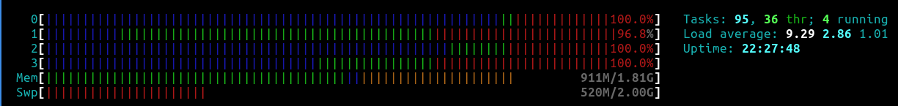

<div align="center">


[](https://github.com/beep-projects/VASpberryPi/blob/main/LICENSE) [](https://github.com/beep-projects/VASpberryPi/actions/workflows/shellcheck.yml) [](https://github.com/beep-projects/VASpberryPi/issues) [](https://github.com/beep-projects/VASpberryPi/network) [](https://github.com/beep-projects/VASpberryPi/stargazers)  [](https://visitorbadge.io/status?path=beep-projects%2FVASpberryPi)
</div>

**VASpberryPi** is a collection of scripts to setup a **Raspberry Pi** with the [Community Edition](https://greenbone.github.io/docs/latest/) of the [Greenbone OpenVAS](https://www.openvas.org/) stack. It is actually following the instructions for [Building 22.4 from Source](https://greenbone.github.io/docs/latest/22.4/source-build/index.html). To emphasize on this, the release versioning follows the versioning of the Greenbone Community Edition. Before you start to setup your **VASpberryPi**, you should read the [Background](https://greenbone.github.io/docs/latest/background.html) information of the Greenbone Community Documentation.

The basic configuration of this project can be done in 5 minutes, while the automated setup will take 60 to 100 minutes. After that you will be able to log into the system via your web browser, but you will have to wait approx. additional 100 minutes, until all feed data is downloaded, before you can start your first scan. So at best you plan about 3.5h to set it all up.


## Contents

- [Requirements](#requirements)
- [Directory Structure of this Project](#directory-structure-of-this-project)
- [Install](#install)
- [Update](#update)
- [Contribute](CONTRIBUTING.md)

## Requirements

<sup>\[[Back to Contents](#contents)\]</sup>

Greenbone gives the following hardware requirements:

|                      | Minimal     | Recommended | Mine |
| -------------------- | ----------- | ----------- | ---- |
| CPU Cores            | 2           | 4           | 4    |
| Random-Access Memory | 4GB         | 8GB         | 2GB  |
| Hard Disk (free)     | 20GB        | 60GB        | 32GB |

The hardware that I used for this project is actually a Raspberry Pi 4 Model B Rev 1.5 with 2GB RAM and a 32GB Micro-SDXC


`htop` shows that 2GB are actually not enough for **VASpberryPi**, but with some swapping the system runs fine.

<center></center>

## Directory Structure of this Project

<sup>\[[Back to Contents](#contents)\]</sup>

```
VASpberryPi
├── .github/workflows                   # actions for verifying/testing commits
├── resources                           # folder for files used for README.md
└── scripts                             # folder holding the files that are copied to the Raspberry Pi OS sd card 
    ├── cmdline.txt                     # this file controls which file is run at boot of raspberry pi
    ├── firstrun.sh                     # script to do basic configuration of the raspberry pi
    ├── secondrun.sh                    # actual setup script of VASpberryPi
    └── thirdrun.sh                     # cleanup script
├── CONTRIBUTING.md
├── LICENSE
├── README.md
├── getAndConfigureVASPberryPi.sh        # script to configure and start the installation
└── install_vaspberrypi.sh               # script to download Raspberry Pi OS and configure it as VASpberryPi
```

## Install

<sup>\[[Back to Contents](#contents)\]</sup>

For installation on **Windows**, I will only give support on specific request. If you read through [install_vaspberrypi.sh](install_vaspberrypi.sh) you should be able to identify the needed steps.  

For installation on **Linux** I provide a script that downloads Raspberry Pi OS and flashes it onto a Micro SD card. The script was mainly written out of curiosity to see how that could work. So it has no added sanity checks and you should use it with care. Check each step, when asked to confirm.  
On Linux you can do the following steps

1. Insert the Micro SD card that you want to get prepared as **VASpberryPi** into your notebook/PC/whatever

2. Run the following commands in your shell

   ```bash
   wget https://github.com/beep-projects/VASpberryPi/releases/latest/download/getAndConfigureVASpberryPi.sh
   chmod 755 getAndConfigureVASpberryPi.sh
   ./getAndConfigureVASpberryPi.sh
   ```

   The next steps in these instructions assume that your user is ```beep``` with password ```projects``` and the configured hostname is ```vaspberrypi```. If you use different values, don't do plain copy & paste.

3. Eject the Micro SD card and insert it into your Raspberry Pi

4. Power up the Raspberry Pi

5. Wait a while (~60-100 minutes, depending on the number of system updates available) 
   For troubleshooting, you can check the progress by checking the logs. After 5 minutes the resize of the partitions and ```firstrun.sh``` should be finished, so that you can ```ssh``` into the **VASPberryPi** and watch the installation process

   ```bash
   ssh -x beep@vaspberrypi
   tail -f ~/secondrun.log
   ```

6. Open [http://vaspberrypi:9392](http://vaspberrypi:9392) in your browser. 

7. The user created user is ```admin``` with password ```projects``` or whatever you configured at the beginning. 

8. You can start to use your system, but before you can start the first scans, you have to wait until the feed data is downloaded. Otherwise you will get strange error messages, when you try to start a scan or task. You can check the status of the feed data here http://vaspberrypi:9392/feedstatus.

## Update

<sup>\[[Back to Contents](#contents)\]</sup>

There is nothing implemented for updating the code of the Greenbone Community Edition. I will think about that, once a new version is available.

The one thing you can do at the moment is [Updating and Upgrading Raspberry Pi OS](https://www.raspberrypi.com/documentation/computers/os.html#updating-and-upgrading-raspberry-pi-os).

## Contribute

<sup>\[[Back to Contents](#contents)\]</sup>

If you want to contribute, [read this](CONTRIBUTING.md).
